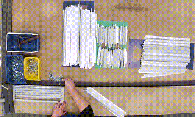

> U ovom dokumentu cilj je napraviti analizu utjecaja operatera i tipa proizvoda
  na trajanje pojedine radne aktivnosti pri montaži metalne rešetke. Izlaz analize će biti 
  informacije o statističkoj značajnosti razlika u radu između pojedinih operatera.


```{r biblioteke, include = FALSE}
library(readxl)
library(dplyr)
library(ggplot2)
library(scales)
library(knitr)
library(rmarkdown)
library(tidyverse)
library(kableExtra)
library(gridExtra)
library(writexl)
options(digits = 3)
```

Podatci koji će biti korišteni u analizi nalaze su u tablici `labels_stat.xlsx`

```{r uvoz podataka, echo=FALSE, warning=FALSE}
path = 'C:/Users/Public/Labels/labels_stat.xlsx'
labs = read_excel(path)
labs[, c("Subject", "Product_type", "Activity_ID")] <- lapply(labs[, c("Subject", "Product_type",
                                                                       "Activity_ID")], as.factor)
labs$Sample_num <- as.factor(as.double(labs$Sample_num))   
kable(head(labs, 10), caption = "Skup podataka o aktivnostima montaže") %>% 
    kable_styling(bootstrap_options = c("striped"))
```

```{r utils, echo=FALSE, warning=FALSE}
#1.1. Generiranje statističkog sažetka o vremenu izvođenja aktivnosti po proizvodu i operateru

##Funkcija za izvlačenje imena radne aktivnosti
act_name_extractor <- function(id_aktivnosti) {
  labs %>% 
    select(Activity_name, Activity_ID) %>%
    unique() %>% 
    filter(Activity_ID == id_aktivnosti) %>% 
    select(Activity_name) %>% 
    as.character()
}

##Glavna funkcija
act_summary <- function(id_aktivnosti) {
    
    #Izvlačenje statističkog sažetka vremena izvođenja određene aktivnosti po proizvodu i operateru
    
    #Ime sažetka
    activity_name <- act_name_extractor(id_aktivnosti)
    capt_name <- paste0("Statistički sažetak vremena izvođenja aktivnosti: ", 
                            activity_name, " (", id_aktivnosti, ")")
      
    sazetak <- labs %>% 
      filter(Activity_ID == id_aktivnosti) %>% 
      select(Product_type, Subject, Sample_num, Duration) %>% 
      group_by(Product_type, Subject) %>% 
      summarise("Prosječno vrijeme izvođenja aktivnosti" = mean(Duration), "SD" = sd(Duration), 
                "Medijan vremena izvođenja aktivnosti" = median(Duration), "IQR" = IQR(Duration),
                "MIN" = min(Duration), "MAX" = max(Duration), .groups = "drop") 
      #Izlaz
      list(sazetak = sazetak, caption = capt_name)
}

#1.2 Boxplot graf usporedbe vremena izvođenja specifične aktivnosti za sve operatere i tipove proizvoda

##Funkcija za izvlačenje podataka potrebnih za kreiranje grafa
act_data <- function(id_aktivnosti) {
    
  #Izvlačenje vremena izvođenja aktivnosti po uzorku za specifičnu radnu aktivnost
  #za sve operatere i proizvode
  
  labs %>%
    filter(Activity_ID == id_aktivnosti) %>% 
    select(Product_type, Subject, Sample_num, Duration)
}

##Glavna funkcija
act_boxplot_graf <- function(id_aktivnosti) {
  
  #Crtanje boxplot grafa usporedbe vremena izvođenja aktivnosti operatera 
  #za određenu aktivnost i proizvod
  
  #Naslov grafa
  activity_name <- act_name_extractor(id_aktivnosti)
  graf_name <- paste0("Usporedba vremena izvođenja aktivnosti: ", activity_name,
                      " (", id_aktivnosti, ")","\npo operateru i tipu proizvoda")
  
  #Podatci za graf
  graf_data <- act_data(id_aktivnosti)
  
  
  #Crtanje grafa
  ggplot(graf_data, aes(Subject, Duration, color=Subject))+
    stat_boxplot(geom = "errorbar")+
    geom_boxplot()+
    facet_wrap(.~Product_type)+
    labs(title = graf_name, x="Operater", y="Vrijeme izvođenja aktivnosti [s]")+
    theme(legend.position = "None")
}

#1.3 Otkrivanje outliera za svakog operatera i tip proizvoda te specifičnu aktivnost

##Funkcija za izvlačenje potrebnih podataka
opt_data <- function(id_operater, tip_proizvoda, id_aktivnosti) {
  
  #Izvlačenje vremena izvođenja jednog ili više tipova aktivnosti, od strane jednog ili više operatera 
  #na jednom ili više tipova proizvoda
  
  labs %>%  
    filter(Subject %in% id_operater, Product_type %in% tip_proizvoda, Activity_ID %in% id_aktivnosti) %>% 
    select(Product_type, Subject, Activity_ID, Sample_num, Duration)
}

##Glavna funkcija za crtanje grafa
act_series_graf <- function(id_operater, tip_proizvoda, id_aktivnosti) {
    
  #Time series graf vremena izvođenja jedne radne aktivnosti od strane jednog ili više
  #operater na jednom ili više tipova proizvoda
  
  #Podatci za crtanje
  graf_data <- opt_data(id_operater, tip_proizvoda, id_aktivnosti)
  
  #Naslov grafa
  activity_name <- act_name_extractor(id_aktivnosti)
  graf_name <- paste0("Usporedba vremena izvođenja aktivnosti: ", activity_name,
                      " (", id_aktivnosti, ")","\nza operatera: ", 
                      id_operater," i tip proizvoda: ", tip_proizvoda)
    
  #Izračun statističkih parametara
  kvantili <- quantile(graf_data$Duration)
  activity_median <- kvantili[3]
  activity_iqr <- diff(kvantili[c(2, 4)])
  ub_time <- kvantili[4] + 1.5 * activity_iqr
  lb_time <- kvantili[2] - 1.5 * activity_iqr
    
  #Označavanje outliera
  outliers <- (graf_data$Duration <= lb_time) | (graf_data$Duration >= ub_time)
  outlier_data <- graf_data[outliers, ]
    
  
  #Granice na grafu koje odgovaraju pozicijama "brkova" na boxplot grafu
  donja_granica <- min(graf_data$Duration[!outliers]) #od vrijednosti koje nisu outlieri koja je najmanja
  gornja_granica <- max(graf_data$Duration[!outliers])
   
  #Iscrtavanje grafa
  ggplot(graf_data, aes(Sample_num, Duration, group = 1)) + #group = 1 je potrebno inače je graf pomaknut!!!
    geom_hline(aes(yintercept = activity_median, color = "lightblue"), linetype="solid")+
    geom_hline(aes(yintercept = donja_granica, color = "green"), linetype = "dashed")+
    geom_hline(aes(yintercept = gornja_granica, color = "red"), linetype = "dashed")+
    scale_color_identity(name = "",
                         breaks = c("red", "lightblue", "green"),
                         labels = c("Gornja granica", "Medijan", "Donja granica"),
                         guide = "legend")+
    geom_line()+
    geom_point(color ="blue", pch=17, size=2)+
    geom_label(data = outlier_data, mapping = aes(x = Sample_num, y = Duration, label = Sample_num),
               fontface = "bold", family = "sans", size = 3.25, hjust = - 0.2, vjust = 0.95)+
    labs(title = graf_name, x = "Broj opažanja", y = "Vrijeme izvođenja [s]")+
    theme(axis.text.x = element_text(size = 7, angle = 90), legend.position = c(1, 1), legend.justification = c(1,1 ), legend.title = element_blank(), legend.background = element_rect(fill = "white", linetype = "solid", color = "black"))
}

#1.4 Testiranje normalnosti podataka po operaterima, za jednu vrstu aktivnosti i proizvoda

normality_test <- function(id_aktivnosti) {
  
  #Testiranje normalnosti podataka grupiranih po operaterima, 
  #za jednu vrstu aktivnosti i proizvoda
  
  #Podatci za testiranje
  operateri <- unique(labs$Subject)
  proizvodi <- unique(labs$Product_type)
  test_data <- act_data(id_aktivnosti)
  
  #Petlja po proizvodima i operaterima
  test_normalnosti <- list()
  for (proizvod in proizvodi) {
    for (operater in operateri) {
      duration_data <- test_data %>% 
        filter(Product_type == proizvod, Subject == operater) %>% 
        select(Duration)
      
      individual_results <- shapiro.test(duration_data$Duration)
      test_normalnosti[[proizvod]][[operater]] <- ifelse(individual_results$p.value >= 0.05,
                                                                         "H0", "H1")
    }
  }
  
  #Ispis rezultata testova
  activity_name <- act_name_extractor(id_aktivnosti)
  
  for (proizvod in proizvodi) {
    cat(sprintf("Rezultati testa normalnosti vremena izvođenja aktivnosti %s (%s) za proizvod %s:\n \n",
                activity_name, id_aktivnosti, proizvod))
    #Prebrojavanja rezultata
    non_normal_dist <- 0
    for (operater in operateri) {
      if (test_normalnosti[[proizvod]][[operater]] == "H1") {
        non_normal_dist <- non_normal_dist + 1
      }
    }
    cat(sprintf("Od 4 napravljena testa njih %i ukazuje na to da vrijeme izvođenja aktivnosti \ngrupirano po operateru nije normalno distribuirano na razini povjerenja od 95%%. \n \n", non_normal_dist))
  }
}

#1.5 Testiranje razlika između više operatera za svaki tip proizvoda (sa i bez O3)

multi_opt_test <- function(id_aktivnosti, ignore_O3 = FALSE) {
  
  #KW test razlika u vremenu izvođenja specifične aktivnosti od strane različitih 
  #operatera na istom proizvodu
  
  #Podatci za testiranje
  proizvodi <- unique(labs$Product_type)
  operateri <- unique(labs$Subject)
  if (ignore_O3)  operateri <- operateri[-3]
  test_data <- opt_data(operateri, proizvodi, id_aktivnosti)
  
  #Petlja po proizvodima
  kw_test <- list()
  for (proizvod in proizvodi) {
    duration_data <- test_data %>% 
      filter(Product_type == proizvod) %>% 
      select(Subject, Duration)
        
    results <- kruskal.test(duration_data$Duration, duration_data$Subject)$p.value
    kw_test[proizvod] <- ifelse(results >=0.05, "H0", "H1")
  }
  
  #Ispis rezultata
  activity_name <- act_name_extractor(id_aktivnosti)
  cat(sprintf("Kruskal-Wallis test razlika u vremenu izvođenja aktivnosti %s (%s) između različitih operatera \n(O3 %s) na istom tipu proizvoda: \n",
              activity_name, id_aktivnosti, {if (!ignore_O3) "uključen" else "isključen"}))
  
  h1_counter <- 0
  for (name in names(kw_test)) {
    cat(sprintf("Rezultati testa za proizvod %s: %s \n", name, kw_test[name]))
    if (kw_test[name] == "H1") {
      h1_counter <- h1_counter + 1
    }
  }
  cat(sprintf("\nU slučaju %i proizvoda postoji statistički značajna razlika u vremenu izvođenja aktivnosti \nod strane različitih operatera.\n", h1_counter))
}

#1.6 Testiranje razlika u radu jednog operatera na različitim tipovima proizvoda

one_opt_test <- function(id_aktivnosti) {
  
  #KW test razlika u vremenu izvođenja specifične aktivnosti od strane jednog operatera
  #na različitim proizvodima
  
  #Podatci za testiranje
  proizvodi <- unique(labs$Product_type)
  operateri <- unique(labs$Subject)
  test_data <- opt_data(operateri, proizvodi, id_aktivnosti)
  
  #Petlja po operaterima
  kw_test <- list()
  for (operater in operateri) {
    duration_data <- test_data %>% 
      filter(Subject == operater) %>% 
      select(Product_type, Duration)
        
    results <- kruskal.test(duration_data$Duration, duration_data$Product_type)$p.value
    kw_test[operater] <- ifelse(results >=0.05, "H0", "H1")
  }
  
  #Ispis rezultata
  activity_name <- act_name_extractor(id_aktivnosti)
  cat(sprintf("Kruskal-Wallis test razlika u vremenu izvođenja aktivnosti %s (%s) od strane istog operatera \nna različitim tipovima proizvoda: \n",
              activity_name, id_aktivnosti))
  
  h1_counter <- 0
  for (name in names(kw_test)) {
    cat(sprintf("Rezultati testa za operatera %s: %s \n", name, kw_test[name]))
    if (kw_test[name] == "H1") {
      h1_counter <- h1_counter + 1
    }
  }
  cat(sprintf("\nU slučaju %i operatera postoji statistički značajna razlika u vremenu izvođenja aktivnosti \nna različitim proizvodima.\n", h1_counter))
}

```

Analiza uzorka sastoji se od tri elementa:

* deskriptivna obrada uzorka
* vizualizacija podataka iz uzorka
* ispitivanje hipoteza i statističko zaključivanje

### 1. Opći opis uzorka
Uzorak sadržava **`r n_distinct(labs$Sample_num)`** opažanja i **`r ncol(labs)`** varijabli. Varijable korištene u analizi su:

* `Video_ID` - alfanumerička oznaka video zapisa koji su dio uzorka
* `Activity_ID` - numerička oznaka radne aktivnosti
* `Activity_name` - naziv radne aktivnosti
* `Start_time` - trenutak početka radne aktivnosti, mjereno u sekundama od početka video zapisa
* `End_time` - trenutak završetka radne aktivnosti, mjereno u sekundama od početka video zapisa
* `Duration` - vrijeme trajanja radne aktivnosti, mjereno u sekundama
* `Sample_num` - numerička oznaka opažanja
* `Subject` - alfanumerička oznaka operatera koji izvodi aktivnost 
* `Product_type` - alfanumerička oznaka tipa proizvoda na kojem se izvode aktivnosti

Svako opažanje sadrži **`r n_distinct(labs$Activity_ID)`** različitih aktivnosti. Dok je ukupan broj aktivnosti u cijelom uzorku: **5580**. Oznake i nazivi aktivnosti su:
```{r oznake aktivnosti, echo=FALSE, warning=FALSE}
labs %>% 
    filter(Sample_num == 1) %>% 
    select(Activity_ID, Activity_name) %>% 
    kable(caption = "Oznake radnih aktivnosti montaže") %>% 
    kable_styling(bootstrap_options = c("striped"))
```

Prilikom oblikovanja uzorka cilj je bio imati ujednačene količine opažanja po 
operaterima i tipovima proizvoda. Dio opažanja je odbačen zbog razloga koji će
biti detaljno opisani u nastavku.

Aktivnosti izvode **`r n_distinct(labs$Subject)`** različita operatera. Oznake operatera su: **`r levels(labs$Subject)`**.\
Aktivnosti se izvode na **`r n_distinct(labs$Product_type)`** različita tipa proizvoda. Oznake tipa proizvoda su: **`r levels(labs$Product_type)`**.

```{r opazanja po operateru, echo=FALSE, warning=FALSE}
opazanja_po_opt <- labs %>% 
    select(Subject, Product_type, Sample_num) %>% 
    group_by(Subject, Product_type) %>% 
    summarise("broj_opazanja" = n_distinct(Sample_num), .groups="drop")

ggplot(opazanja_po_opt, aes(Subject, broj_opazanja))+
  geom_col(color="black")+
  geom_text(aes(label=broj_opazanja),vjust=2,fontface="bold", color="white")+
  facet_wrap(.~Product_type)+
    labs(title = "Broj opažanja po operateru", x="Operater", y="Broj opažanja")+
    theme(legend.position = "None")
```

### 2. Analiza ukupnog vremena montaže
> Ukupno vrijeme je mjereno od početka prve aktivnosti do završetka posljednje aktivnost te
  stoga u sebi sadrži **value-added**, **non-value-added** i **waste** vrijeme.
  
```{r vremena montaže po uzorku, echo=FALSE}
tablica_1 <- labs %>%
    select(Subject, Product_type, Sample_num, Activity_ID, Start_time, End_time) %>%
    filter(Activity_ID %in% c(1, 6)) %>%
    group_by(Subject, Product_type, Sample_num) %>%
    summarise(time = End_time - lag(Start_time), .groups="drop") %>% 
    drop_na() %>% 
    ungroup()
```

```{r distribucija ukupnog vremena trajanja uzoraka, echo=FALSE}
ggplot(tablica_1, aes(time))+
    geom_histogram(bins = 32, color="black")+
    geom_vline(xintercept = median(tablica_1$time), color= "yellow", size=2)+
    annotate("label", x=60, y=60, 
             label=paste("Me = ", median(tablica_1$time)," [s]\n", 
                         "min = ", min(tablica_1$time), " [s]\n",
                         "max = ", max(tablica_1$time), " [s]", sep = ""))+
    labs(title="Raspodjela ukupnog vremena trajanja video zapisa",
         x = "Ukupno vrijeme video zapisa [s]",
         y = "Frekvencija") +
    scale_x_continuous(breaks = seq(30, 100, by = 10))+
    scale_y_continuous(breaks = seq(0, 70, by = 10))
```

Ukupno vrijeme montaže ujedno je predstavlja i ukupno vrijeme trajanja pojedinog
video zapisa, stoga iz raspodjele vidljivo da postoji značajna varijabilnost u 
trajanju pojedinih video zapisa.

Kako bi se napravili odgovarajući grafovi i statistički sažeci ukupnog vremena montaža
za različite operatera na različitim tipovima proizvoda inicijalno je napravljeno 
**testiranje normalnosti distribucije** ukupnog vremena montaže za 12 podskupova podataka (4 operater i 3 tipa proizvoda). Testiranje je napravljeno primjenom **Shapiro-Wilk testa**. 

```{r testiranje normalnosti ukupnog vremena montaže, echo=FALSE, warning=FALSE}
test_normalnosti <- list()
for (operater in unique(labs$Subject)) {
    for (product in unique(labs$Product_type)) {
        data <- tablica_1 %>% 
            filter(Subject == operater, Product_type == product) %>% 
            select(time)
        
        test_results <- shapiro.test(data$time)
        test_normalnosti[paste(operater, product, sep = "_")] <- ifelse(test_results$p.value >= 0.05, 
                                                                        "H0", "H1")
    }
} 

non_normal_dist <- 0 
for (rez in test_normalnosti) {
    if (rez == "H1") {
        non_normal_dist <- non_normal_dist + 1
    }
}
cat(sprintf("Od 12 napravljenih testova njih %i ukazuje na to da raspodjela ukupnog vremena montaže \nnije normalno distribuirana na razini povjerenja od 95%%", non_normal_dist))
```

Osim uobičajenog sažetka u vidu aritmetičke sredine i standardne devijacije, prikazan je 
i sažetak primjenom mjera medijana i interkvartilnog raspona iz razloga što se distribucija
ukupnog vremena montaže ne pokorava normalnoj razdiobi.

```{r statistički sažeci ukupnog vremena montaže, echo=FALSE, warning=FALSE}
tablica_2 <- labs %>%
    select(Subject, Product_type, Sample_num, Activity_ID, Start_time, End_time) %>%
    filter(Activity_ID %in% c(1, 6)) %>%
    group_by(Subject, Product_type, Sample_num) %>%
    summarise(time = End_time - lag(Start_time), .groups="drop") %>% 
    drop_na() %>% 
    group_by(Product_type, Subject) %>% 
    summarise("Prosječno vrijeme montaže" = mean(time), "SD" = sd(time), "Medijan vremena montaže" = median(time), "IQR" = IQR(time),"MIN" = min(time), "MAX" = max(time),.groups="drop")
kable(tablica_2, caption = "Statistički sažeci ukupnog vremena montaže po tipu proizvoda i operateru" ) %>% 
    kable_styling(bootstrap_options = c("striped"))
```
Na boxplot prikazu ukupnog vremena po operateru i tipu proizvoda kao mjera
položaja korišten je medijan, a kao mjera rasprostiranja 1.58 * IQR.

```{r slika 1, echo=FALSE, warning=FALSE}
ggplot(tablica_1, aes(Subject, time, color=Subject))+
    stat_boxplot(geom = "errorbar")+
    geom_boxplot()+
    facet_wrap(.~Product_type)+
    labs(title = "Usporedba ukupnog vremena montaže po operateru i tipu proizvoda",
         x="Operater", y="Ukupno vrijeme montaže [s]")+
    theme(legend.position = "None")
```

Boxplot graf ukazuje na potencijalno značajne razlike u ukupnom
vremenu montaže između operatera. U nastavku je napravljeno testiranje
razlike medijana ukupnog vremena izvođenja montaže između operatera po svakom tipu 
proizvoda primjenom **Kruskal-Wallis testa**. 

```{r testiranje značajnosti razlika između operatera, echo=FALSE, warning=FALSE}
kw_test <- list()
for (product in unique(labs$Product_type)) {
    data <- tablica_1 %>% 
        filter(Product_type == product) %>% 
        select(Subject, time)
        
        test_results <- kruskal.test(data$time, data$Subject)$p.value
        kw_test[product] <- ifelse(test_results >=0.05, "H0", "H1")
}
for (i in names(kw_test)) {
   cat(sprintf("Rezultati testa za proizvod %s: %s \n", i, kw_test[i]))
}
```

>Rezultati potvrđuju da postoje značajne razlike između barem jednog para operatera po svakom
 tipu proizvoda na razini povjerenja od 95%. Pretpostavka je da najveći utjecaj na ovakav rezultat ima operater  **O3**. Stoga je napravljen još jedna runda testiranja pri čemu je iz testa isključen operater **O3**.

```{r testiranje značajnosti razlika između operatera BEZ O3, echo=FALSE, warning=FALSE}
kw_test_wo_O3 <- list()
for (product in unique(labs$Product_type)) {
    data <- tablica_1 %>% 
        filter(Product_type == product & Subject != "O3") %>% 
        select(Subject, time)
        
        test_results <- kruskal.test(data$time, data$Subject)$p.value
        kw_test_wo_O3[product] <- ifelse(test_results >=0.05, "H0", "H1")
}
for (i in names(kw_test_wo_O3)) {
   cat(sprintf("Rezultati testa za proizvod %s: %s \n", i, kw_test_wo_O3[i]))
}
```

>U slučaju analize razlika ukupnog vremena montaže između svih operatera osim **O3**, samo u slučaju proizvoda  tipa **T2** ne postoje statistički značajne razlike u vremenu izvođenja.

U nastavku analize ukupnog vremena montaže, dan je pregled prosječnog value-added vremena
po operateru i tipu proizvoda.

```{r udio value-added vremena, echo = FALSE}
tablica_3 <- labs %>% 
    select(Subject, Product_type, Sample_num, Duration) %>% 
    group_by(Product_type, Subject, Sample_num,) %>% 
    summarise(VAT = sum(Duration), .groups="drop") %>% 
    group_by(Product_type, Subject) %>% 
    summarise("Prosječni VAT" = mean(VAT), .groups="drop")
    
tablica_3[, c("Prosječno vrijeme montaže")] <- tablica_2$`Prosječno vrijeme montaže`
tablica_3 <- mutate(tablica_3, "VAT [%]" = (`Prosječni VAT`/`Prosječno vrijeme montaže`) * 100)

kable(tablica_3, caption = "Prosječni VAT montaže po tipu proizvoda i operateru") %>% 
    kable_styling(bootstrap_options = c("striped"))
```
>Uočeno je da prosječni udio VAT-a u ukupnom vremenu montaže iznosi `r round(mean(tablica_3[[5]]), 2)`%.

### 3. Analiza vremena radnih aktivnosti

Vrijeme pojedinih aktivnosti značajno varira u trajanju na što između ostalog
utječu različiti operateri i tipovi proizvoda. Distribucija vremena trajanja 
pojedinih aktivnosti neovisno od tipa operatera i tipa proizvoda prikazana je
u nastavku.

```{r distribucija vremena trajanja aktivnosti, echo=FALSE, warning=FALSE}
akt_graf_sve <- list()
for (i in unique(labs$Activity_ID)) {
    df <- opt_data(unique(labs$Subject), unique(labs$Product_type), i)
    akt_graf_sve[[i]] <- ggplot(df, aes(Duration))+
        geom_histogram(color="black", bins=ceiling(1 + 3.3 * log10(nrow(df))))+
        geom_vline(xintercept = median(df$Duration), size=1, color="yellow")+
        geom_text(aes(label=paste("Me =",round(median(Duration), 2))), x=Inf, y=Inf,vjust=1, hjust=1, size=3)+
        labs(title = paste("Distribucija vremena trajanja aktivnosti:\n", act_name_extractor(i), sep=""),
             x = "Vrijeme trajanja aktivnosti [s]", y = "Frek.")+
        theme(title = element_text(size=6), axis.title.x = element_text(size=8),
              axis.title.y = element_text(size=8))
} 

grid.arrange(grobs=akt_graf_sve, nrow=3, ncol=3)
```

```{r statistički sažeci za sve radne aktivnosti, echo=FALSE, warning=FALSE}
#Petlja po aktivnostima
aktivnosti <- sort(unique(labs$Activity_ID))
time_summary <- list()

for (aktivnost in aktivnosti) {
  time_summary[[aktivnost]] <- act_summary(aktivnost)
 }
```

```{r usporedbe operatera boxplot po aktivnostima, echo=FALSE, warning=FALSE}
#Petlja po aktivnostima
aktivnosti <- sort(unique(labs$Activity_ID))
bx_plots <- list()

for (aktivnost in aktivnosti) {
  bx_plots[[aktivnost]] <- act_boxplot_graf(aktivnost)
 }
```

```{r podatci za odabir videa, echo=FALSE, warning=FALSE}

video_data <- labs %>% 
  select(Video_ID,Subject, Product_type, Activity_ID, Sample_num, Duration) %>% 
  filter(Product_type == "T2") %>% #Odabrani su samo proizvodi tip T2 
  group_by(Activity_ID, Subject) %>% #Grupiranje po aktivnosti jer nam trebaju tipične vrj. pojedine aktivnosti
  filter(Duration == median(Duration) | Sample_num == 485) %>% #Ovih 485 je hack jer inače nema 8 akt. za O4,
                                                              #jer ima parni broj opažanja pa je medijan bio
                                                              #prosjek dvije vrijednosti
  distinct(Activity_ID, .keep_all = TRUE) #zadrži samo jedan uzorak od svakog tipa aktivnosti po operateru


write_xlsx(video_data, "C:/Users/Public/tipical_activities.xlsx")
```

U ovom dijelu zasebno je analizirana svaka od 9 radnih aktivnosti montaže. Produkti
analize svake pojedine aktivnosti su slijedeći:

**1. statistički sažetak vremena izvođenja aktivnosti** 

U sažetku su dane vrijednosti statističkih pokazatelja poput aritmetičke sredine i medijana te
mjere rasipanja poput standardne devijacije i interkvartilnog raspon. Svi pokazatelji
grupirani su po pojedinom proizvodu i operateru.

**2. vizualna usporedba vremena izvođenja aktivnosti** 

U ovom dijelu generirani su boxplot grafovi vremena izvođenja radne aktivnosti, sa svrhom
usporedbe operatera po pojedinom tipu proizvoda.

**3. testiranje razlika u vremenu izvođenja aktivnosti**

Na temelju vizualne usporedbe vremena izvođenja aktivnosti proizlaze dva pitanja:
  
  a) Da li postoje značajne razlike između različitih operatera u vremenu izvođenja iste 
  aktivnosti na istom tipu proizvoda?\
  b) Da li postoje značajne razlike u vremenu izvođenja iste aktivnosti na različitim
  tipovima proizvoda od strane jednog operatera?

Kako bi se ispitale ove dvije hipoteze, prvo je ispitana normalnost podataka vremena 
izvođenja aktivnosti grupirana po tipu proizvoda, aktivnosti i operatera, a nakon toga 
su napravljeni odgovarajući testovi kako bi se utvrdilo da li su te razlike 
statistički značajne, (**Kruskal-Wallis** za usporedbu više uzoraka, a jednostrani **Mann-Whitney** 
za parove uzoraka).

**4. vizualizacija i analiza outliera u vremenu izvođenja radnih aktivnosti**

Završno je napravljen istraživanje vremenskih serija izvođenja radnih aktivnosti po
pojedinom operateru i tipu proizvodu, kako bi se mogli interpretirati potencijalni
razlozi pojave odstupanja u vremenima izvođenja radnih aktivnosti. Procedura
utvrđivanja outliera za pojedinog operatera na pojedinom tipu proizvoda bazirana je 
na tome da svako opažanja koje nije u intervalu:

>$[Q_1 - 1.5 \cdot IQR, Q_3 + 1.5 \cdot IQR]$

predstavlja outlier. Analiza aktivnosti slijedi u nastavku.

#### **1. Aktivnost:** Formiranje kuta

<table align="center">
  <tr align="center" style="color:blue; font-size:20px">
    <td>Operater 1</td>
     <td>Operater 2</td>
  </tr>
  <tr>
    <td></td>
    <td></td>
  </tr>
  <tr align="center" style="color:blue; font-size:20px">
    <td>Operater 3</td>
    <td>Operater 4</td>
  </tr>
  <tr>
    <td></td>
    <td></td>
  </tr>
</table>
<p style="font-size:16px" align="center">Tipični način izvođenja 1. aktivnosti</p>

```{r stat sažetak A1, echo=FALSE, warning=FALSE}
kable(time_summary[[1]][["sazetak"]], caption = time_summary[[1]][["caption"]]) %>% 
  kable_styling(bootstrap_options = "striped")
```

```{r bx_plot A1, echo=FALSE, warning=FALSE}
bx_plots[[1]]
```

```{r test normalnosti A1, echo=FALSE, warning=FALSE}
normality_test(1)
```

```{r multi test A1, echo=FALSE, warning=FALSE}
multi_opt_test(1, ignore_O3 = FALSE)
```
> **Zaključak 1**: Uspoređivanjem svih operatera po pojedinom tipu proizvoda potvrđeno je da 
postoji značajna razlika u brzini izvođenja **aktivnosti 1** kod svih tipova proizvoda. Graf
sugerira da je razlog ovih razlika najvjerojatnije operater **O3**, stoga je potrebno napraviti
dodatno testiranje u kojem taj operater neće biti uključen.

```{r multi test A1 BEZ O3, echo=FALSE, warning=FALSE}
multi_opt_test(1, ignore_O3 = TRUE)
```
> **Zaključak 2**: Kada je iz testiranja isključen operater **O3** značajna razlika u brzini izvođenja **aktivnosti 1** prisutna je samo u slučaju proizvoda **T3**, ova razlika posljedica je toga što
operater **O1** radi brže u odnosu na preostala 2 operatera.

```{r one test A1, echo=FALSE, warning=FALSE}
one_opt_test(1)
```
> **Zaključak 3**: **Aktivnosti 1** gotovo svi operateri izvode isto neovisno o vrsti proizvoda,
jedino je kod **O4** uočena razlika u brzini izvođenja ove aktivnosti kod proizvoda **T2** i **T3**.

Kako je kod operatera **O1** uočena najveća količina outliera na boxplot grafu, dodatno su 
analizirane njegove vremenske serija za sva tri tipa proizvoda.

```{r outlieri A1, echo=FALSE, warning=FALSE}
act_series_graf("O1", "T1", 1)
```
```{r outlieri A1_2, echo=FALSE, warning=FALSE}
act_series_graf("O1", "T2", 1)
```
```{r outlieri A1_3, echo=FALSE, warning=FALSE}
act_series_graf("O1", "T3", 1)
```

> **Zaključak 4**: U slučaju operatera **O1** outlieri su posljedica činjenica da 
je npr. u uzorcima **78, 121, 146** aktivnost odužena zbog toga jer su poprečne stranice
potrebne za formiranje kuta bile previše udaljene.


#### **2. Aktivnost:** Umetanje i učvrščivanje kopče LG (lijeve gornje)

<table align="center">
  <tr align="center" style="color:blue; font-size:20px">
    <td>Operater 1</td>
     <td>Operater 2</td>
  </tr>
  <tr>
    <td></td>
    <td></td>
  </tr>
  <tr align="center" style="color:blue; font-size:20px">
    <td>Operater 3</td>
    <td>Operater 4</td>
  </tr>
  <tr>
    <td></td>
    <td></td>
  </tr>
</table>
<p style="font-size:16px" align="center">Tipični način izvođenja 2. aktivnosti</p>

```{r stat sažetak A2, echo=FALSE, warning=FALSE}
kable(time_summary[[2]][["sazetak"]], caption = time_summary[[2]][["caption"]]) %>% 
  kable_styling(bootstrap_options = "striped")
```

```{r bx_plot A2, echo=FALSE, warning=FALSE}
bx_plots[[2]]
```

```{r test normalnosti A2, echo=FALSE, warning=FALSE}
normality_test(2)
```

```{r multi test A2, echo=FALSE, warning=FALSE}
multi_opt_test(2, ignore_O3 = FALSE)
```
> **Zaključak 1**: Uspoređivanjem svih operatera po pojedinom tipu proizvoda potvrđeno je da 
postoji značajna razlika u brzini izvođenja **aktivnosti 2** kod svih tipova proizvoda. Graf
sugerira da je razlog ovih razlika najvjerojatnije operater **O3**, stoga je potrebno napraviti
dodatno testiranje u kojem taj operater neće biti uključen.

```{r multi test A2 BEZ O3, echo=FALSE, warning=FALSE}
multi_opt_test(2, ignore_O3 = TRUE)
```
> **Zaključak 2**: Kada je iz testiranja isključen operater **O3** značajna razlika u brzini izvođenja **aktivnosti 2** prisutna je u slučaju proizvoda **T2** i **T3**. Ova razlika posljedica je toga što
operater **O1** radi statistički značajno brže od operatera **O2** za proizvod **T2**, a u slučaju proizvoda **T3** i **O1** i **O4** rade brže od operatera **O2**.

```{r one test A2, echo=FALSE, warning=FALSE}
one_opt_test(2)
```
> **Zaključak 3**: **Aktivnosti 2** operateri **O1** i **O4** izvode isto neovisno o vrsti proizvoda. Kod operatera **O2** i **O3** uočena je razlika u brzini izvođenja ove aktivnosti ovisno o vrsti proizvoda.

Kako je kod operatera **O3** značajan outliera kod **T1** proizvoda na boxplot grafu, dodatno je 
analizirana njegova vremenska serija za taj proizvod.

```{r outlieri A21, echo=FALSE, warning=FALSE}
act_series_graf("O3", "T1", 2)
```

> **Zaključak 4**: U slučaju operatera **O3** outlieri su posljedica činjenica da 
je npr. u uzorku **625** aktivnost odužena zbog toga jer postoje fizički problemi
kod umetanja kopče.

#### **3. Aktivnost:** Umetanje lamela

<table align="center">
  <tr align="center" style="color:blue; font-size:20px">
    <td>Operater 1</td>
     <td>Operater 2</td>
  </tr>
  <tr>
    <td></td>
    <td></td>
  </tr>
  <tr align="center" style="color:blue; font-size:20px">
    <td>Operater 3</td>
    <td>Operater 4</td>
  </tr>
  <tr>
    <td></td>
    <td></td>
  </tr>
</table>
<p style="font-size:16px" align="center">Tipični način izvođenja 3. aktivnosti</p>

```{r stat sažetak A3, echo=FALSE, warning=FALSE}
kable(time_summary[[3]][["sazetak"]], caption = time_summary[[3]][["caption"]]) %>% 
  kable_styling(bootstrap_options = "striped")
```

```{r bx_plot A3, echo=FALSE, warning=FALSE}
bx_plots[[3]]
```

```{r test normalnosti A3, echo=FALSE, warning=FALSE}
normality_test(3)
```

```{r multi test A3, echo=FALSE, warning=FALSE}
multi_opt_test(3, ignore_O3 = FALSE)
```
> **Zaključak 1**: Uspoređivanjem svih operatera po pojedinom tipu proizvoda potvrđeno je da 
postoji značajna razlika u brzini izvođenja **aktivnosti 3** kod svih tipova proizvoda. Graf
sugerira da je razlog ovih razlika najvjerojatnije operater **O3**, stoga je potrebno napraviti
dodatno testiranje u kojem taj operater neće biti uključen.

```{r multi test A3 BEZ O3, echo=FALSE, warning=FALSE}
multi_opt_test(3, ignore_O3 = TRUE)
```
> **Zaključak 2**: Kada je iz testiranja isključen operater **O3** značajna razlika u brzini izvođenja **aktivnosti 3** prisutna je i dalje u slučaju svih proizvoda. U slučaju sva tri tipa proizvoda operateri 
 **O1** i  **O4** rade statistički značajno brže od operatera **O2**.

```{r one test A3, echo=FALSE, warning=FALSE}
one_opt_test(3)
```
> **Zaključak 3**: Kod **aktivnosti 3** brzina svih operatera značajno je različita jer je proizvod **T3** većih dimenzija te su stoga svi operateri sporiji na tome proizvodu.

#### **4. Aktivnost:** Postavljanje poprečne stranice

<table align="center">
  <tr align="center" style="color:blue; font-size:20px">
    <td>Operater 1</td>
     <td>Operater 2</td>
  </tr>
  <tr>
    <td></td>
    <td></td>
  </tr>
  <tr align="center" style="color:blue; font-size:20px">
    <td>Operater 3</td>
    <td>Operater 4</td>
  </tr>
  <tr>
    <td></td>
    <td></td>
  </tr>
</table>
<p style="font-size:16px" align="center">Tipični način izvođenja 4. aktivnosti</p>

```{r stat sažetak A4, echo=FALSE, warning=FALSE}
kable(time_summary[[4]][["sazetak"]], caption = time_summary[[4]][["caption"]]) %>% 
  kable_styling(bootstrap_options = "striped")
```

```{r bx_plot A4, echo=FALSE, warning=FALSE}
bx_plots[[4]]
```

```{r test normalnosti A4, echo=FALSE, warning=FALSE}
normality_test(4)
```

```{r multi test A4, echo=FALSE, warning=FALSE}
multi_opt_test(4, ignore_O3 = FALSE)
```
> **Zaključak 1**: Uspoređivanjem svih operatera po pojedinom tipu proizvoda potvrđeno je da 
postoji značajna razlika u brzini izvođenja **aktivnosti 4** kod svih tipova proizvoda. Kod **T1** operater **O4** je brži od svih ostalih operatera. Kod **T2** operater **O4** je brži od svih operatera, a **O1** od svih ostalih. Za **T3** svi operateri su brži od **O3**.

```{r one test A4, echo=FALSE, warning=FALSE}
one_opt_test(4)
```
> **Zaključak 2**: Kod **aktivnosti 4** brzina svih operatera značajno je različita jer je proizvod **T3**
većih dimenzija te su stoga svi operateri sporiji na tome proizvodu, jer jer poprečna stranica dulja te ima više pozicija za umetanje lamela.

#### **5. Aktivnost:** Postavljanje uzdužne stranice

<table align="center">
  <tr align="center" style="color:blue; font-size:20px">
    <td>Operater 1</td>
     <td>Operater 2</td>
  </tr>
  <tr>
    <td></td>
    <td></td>
  </tr>
  <tr align="center" style="color:blue; font-size:20px">
    <td>Operater 3</td>
    <td>Operater 4</td>
  </tr>
  <tr>
    <td></td>
    <td></td>
  </tr>
</table>
<p style="font-size:16px" align="center">Tipični način izvođenja 5. aktivnosti</p>

```{r stat sažetak A5, echo=FALSE, warning=FALSE}
kable(time_summary[[5]][["sazetak"]], caption = time_summary[[5]][["caption"]]) %>% 
  kable_styling(bootstrap_options = "striped")
```

```{r bx_plot A5, echo=FALSE, warning=FALSE}
bx_plots[[5]]
```

```{r test normalnosti A5, echo=FALSE, warning=FALSE}
normality_test(5)
```

```{r multi test A5, echo=FALSE, warning=FALSE}
multi_opt_test(5, ignore_O3 = FALSE)
```
> **Zaključak 1**: Uspoređivanjem svih operatera po pojedinom tipu proizvoda potvrđeno je da 
postoji značajna razlika u brzini izvođenja **aktivnosti 5** kod svih tipova proizvoda. Za proizvod **T1** operater **O4** brži je od svih operatera, a **O2** od ostalih. Za **T2** operater **O4** brži od svih, **O2** od ostalih, a **O1** od **O3**. Za **T3** operater **O4** brži je od svih operatera, a **O2** od ostalih.

```{r one test A5, echo=FALSE, warning=FALSE}
one_opt_test(5)
```
> **Zaključak 2**: Kod **aktivnosti 5** brzina svih operatera osim **O4** značajno varira ovisno o tipu proizvoda.

Kako je kod operatera **O4** uočen značajan outliera kod **T2** proizvoda na boxplot grafu, dodatno je 
analizirana njegova vremenska serija za taj proizvod.

```{r outlieri A5, echo=FALSE, warning=FALSE}
act_series_graf("O4", "T2", 5)
```

> **Zaključak 3**: U slučaju operatera **O4** outlieri su posljedica činjenica da je drugačije radila ovu aktivnost gdje odmah pušta stranicu te ju kasnije podešava kada počne sa umetanjem kopče u **aktivnosti 8**, stoga je ta aktivnost veoma kratka i to je posljedica uzoraka poput: **513, 517, 518, 523, 524, 525.**

#### **6. Aktivnost:** Odlaganje gotovog proizvoda

<table align="center">
  <tr align="center" style="color:blue; font-size:20px">
    <td>Operater 1</td>
     <td>Operater 2</td>
  </tr>
  <tr>
    <td></td>
    <td></td>
  </tr>
  <tr align="center" style="color:blue; font-size:20px">
    <td>Operater 3</td>
    <td>Operater 4</td>
  </tr>
  <tr>
    <td></td>
    <td></td>
  </tr>
</table>
<p style="font-size:16px" align="center">Tipični način izvođenja 6. aktivnosti</p>

```{r stat sažetak A6, echo=FALSE, warning=FALSE}
kable(time_summary[[6]][["sazetak"]], caption = time_summary[[6]][["caption"]]) %>% 
  kable_styling(bootstrap_options = "striped")
```

```{r bx_plot A6, echo=FALSE, warning=FALSE}
bx_plots[[6]]
```

```{r test normalnosti A6, echo=FALSE, warning=FALSE}
normality_test(6)
```

```{r multi test A6, echo=FALSE, warning=FALSE}
multi_opt_test(6, ignore_O3 = FALSE)
```
> **Zaključak 1**: Uspoređivanjem svih operatera po pojedinom tipu proizvoda potvrđeno je da 
postoji značajna razlika u brzini izvođenja **aktivnosti 6** kod svih tipova proizvoda. Za proizvod **T1** operater **O1** i **O3** brži su od operatera, a **O2** i **O4** od ostalih. Za **T2** operater **O1** brži od svih, **O3** od ostalih. Za **T3** operater **O1** brži je od svih operatera, a **O3** od ostalih, a **O2** od **O4**.

```{r one test A6, echo=FALSE, warning=FALSE}
one_opt_test(6)
```
> **Zaključak 2**: Kod **aktivnosti 6** brzina svih operatera osim značajno varira ovisno o tipu proizvoda. Pretpostavka je da je potrebno više vremena kod odlaganja proizvoda većih dimenzija.

Moguće je dati generalni zaključak za aktivnosti **7, 8 i 9**.

> **Aktivnosti 7, 8 i 9** slično kao i **aktivnosti 2** odnose se na umetanje kopče,
međutim na različitoj poziciji cijele konstrukcije. Razlog zašto je ova aktivnost
razbijena na 4 različite leži u tome da su one potenicijalno vizualno različite,
pa će stoga automatiziranom sustava lakše biti naučiti svaku od njih kao posebnu aktivnost.
Većina razlika u brzini izvođenja između operatera po pojedinom proizvodu proizlazi iz
činjenice da je operater **O3** sporiji od ostalih. Ovo je generalni trend kod ova 
četiri tipa aktivnosti, koje bi mogli kategorizirati kao fine aktivnosti u kojima se
**O3** slabije snalazi.

#### **7. Aktivnost:** Umetanje i učvršćivanje kopče DG (desna gornja) 

<table align="center">
  <tr align="center" style="color:blue; font-size:20px">
    <td>Operater 1</td>
     <td>Operater 2</td>
  </tr>
  <tr>
    <td></td>
    <td></td>
  </tr>
  <tr align="center" style="color:blue; font-size:20px">
    <td>Operater 3</td>
    <td>Operater 4</td>
  </tr>
  <tr>
    <td></td>
    <td></td>
  </tr>
</table>
<p style="font-size:16px" align="center">Tipični način izvođenja 7. aktivnosti</p>

```{r stat sažetak A7, echo=FALSE, warning=FALSE}
kable(time_summary[[7]][["sazetak"]], caption = time_summary[[7]][["caption"]]) %>% 
  kable_styling(bootstrap_options = "striped")
```

```{r bx_plot A7, echo=FALSE, warning=FALSE}
bx_plots[[7]]
```

```{r test normalnosti A7, echo=FALSE, warning=FALSE}
normality_test(7)
```

```{r multi test A7, echo=FALSE, warning=FALSE}
multi_opt_test(7, ignore_O3 = FALSE)
```
> **Zaključak 1**: Uspoređivanjem svih operatera po pojedinom tipu proizvoda potvrđeno je da 
postoji značajna razlika u brzini izvođenja **aktivnosti 6** kod svih tipova proizvoda. Za proizvod **T1** operater **O1** i **O3** brži su od operatera, a **O2** i **O4** od ostalih. Za **T2** operater **O1** brži od svih, **O3** od ostalih. Za **T3** operater **O1** brži je od svih operatera, a **O3** od ostalih, a **O2** od **O4**.

```{r multi test A7 BEZ O3, echo=FALSE, warning=FALSE}
multi_opt_test(7, ignore_O3 = TRUE)
```

```{r one test A7, echo=FALSE, warning=FALSE}
one_opt_test(7)
```

#### **8. Aktivnost:** Umetanje i učvršćivanje kopče DD (desna donja)

<table align="center">
  <tr align="center" style="color:blue; font-size:20px">
    <td>Operater 1</td>
     <td>Operater 2</td>
  </tr>
  <tr>
    <td></td>
    <td></td>
  </tr>
  <tr align="center" style="color:blue; font-size:20px">
    <td>Operater 3</td>
    <td>Operater 4</td>
  </tr>
  <tr>
    <td></td>
    <td></td>
  </tr>
</table>
<p style="font-size:16px" align="center">Tipični način izvođenja 8. aktivnosti</p>

```{r stat sažetak A8, echo=FALSE, warning=FALSE}
kable(time_summary[[8]][["sazetak"]], caption = time_summary[[8]][["caption"]]) %>% 
  kable_styling(bootstrap_options = "striped")
```

```{r bx_plot A8, echo=FALSE, warning=FALSE}
bx_plots[[8]]
```

```{r test normalnosti A8, echo=FALSE, warning=FALSE}
normality_test(8)
```

```{r multi test A8, echo=FALSE, warning=FALSE}
multi_opt_test(8, ignore_O3 = FALSE)
```

```{r multi test A8 BEZ O3, echo=FALSE, warning=FALSE}
multi_opt_test(8, ignore_O3 = TRUE)
```

```{r one test A8, echo=FALSE, warning=FALSE}
one_opt_test(8)
```

#### **9. Aktivnost:** Umetanje i učvršćivanje kopče LD (lijeva donja)

<table align="center">
  <tr align="center" style="color:blue; font-size:20px">
    <td>Operater 1</td>
     <td>Operater 2</td>
  </tr>
  <tr>
    <td></td>
    <td></td>
  </tr>
  <tr align="center" style="color:blue; font-size:20px">
    <td>Operater 3</td>
    <td>Operater 4</td>
  </tr>
  <tr>
    <td></td>
    <td></td>
  </tr>
</table>
<p style="font-size:16px" align="center">Tipični način izvođenja 9. aktivnosti</p>

```{r stat sažetak A9, echo=FALSE, warning=FALSE}
kable(time_summary[[9]][["sazetak"]], caption = time_summary[[9]][["caption"]]) %>% 
  kable_styling(bootstrap_options = "striped")
```

```{r bx_plot A9, echo=FALSE, warning=FALSE}
bx_plots[[9]]
```

```{r test normalnosti A9, echo=FALSE, warning=FALSE}
normality_test(9)
```

```{r multi test A9, echo=FALSE, warning=FALSE}
multi_opt_test(9, ignore_O3 = FALSE)
```

```{r multi test A9 BEZ O3, echo=FALSE, warning=FALSE}
multi_opt_test(9, ignore_O3 = TRUE)
```

```{r one test A9, echo=FALSE, warning=FALSE}
one_opt_test(9)
```

### 4. Grupiranje uzoraka sa obzirom na vrijeme trajanja aktivnosti

> U ovom dijelu analize cilje je pronaći homogene grupe s obzirom na vrijeme trajanja
aktivnositi. Ovo će pomoći kod donošenja odluka vezanih za dimenzije i količinu vremenskih 
prozora potrebnih za generiranje prijedloga aktivnosti u fazi modeliranja.

```{r clustering data, echo=FALSE, warning=FALSE}
#Podatci potrebni za grupiranje
klast_data <- labs %>% 
  select(Product_type, Subject, Activity_ID, Sample_num, Duration)

#Podatci potrebni za stat. sažetak
ss_data <- klast_data %>% 
  group_by(Product_type, Subject, Activity_ID) %>% 
  summarise("ME" = median(Duration), "IQR" = IQR(Duration), 
            "Min" = min(Duration), "Max" = max(Duration), .groups="drop")
```

```{r histogram trajanja aktivnosti, echo=FALSE, warning=FALSE}
ggplot(klast_data, aes(Duration))+
    geom_histogram(bins = ceiling(1 + 3.3 * log10(nrow(klast_data))), color="black")+
    geom_vline(xintercept = median(klast_data$Duration), color= "yellow", size=2)+
    annotate("label", x=10, y=1600, 
             label=paste("Me = ", median(klast_data$Duration)," [s]\n", 
                         "min = ", round(min(klast_data$Duration),2), " [s]\n",
                         "max = ", max(klast_data$Duration), " [s]", sep = ""))+
    labs(title="Raspodjela vremena trajanja svih aktivnosti",
         x = "Vrijeme trajanja aktivnosti [s]",
         y = "Frekvencija") +
    scale_x_continuous(breaks = seq(0, 40, by = 5))

detail_data <- cut(klast_data$Duration, breaks = seq(0, 30, by=1))
detail_data <- as_tibble(detail_data)
detail_data <- detail_data %>% 
  group_by(value) %>% 
  count() %>% 
  rename("Grupa" = value, "Frekvencija" = n)

detail_act_time <- ggplot(detail_data, aes(Grupa, Frekvencija))+
  geom_col(color="black")+
  geom_text(aes(label = Frekvencija), vjust=-0.5, color="black", size=3)+
  theme(axis.text.x = element_text(angle = 90, 8))

```

Pregledom histograma vremena trajanja svih aktivnosti moguće je zaključiti da
**najveću učestalost** imaju aktivnosti čije je trajanje **u raspon od 4 do 6 sekundi**.
Međutim, bitno je primijetiti da je distribucija vremena ima pozitivnu asimetriju
na što treba pripaziti kod provedbe grupiranja.

#### Analiza aktivnosti trajanja do najviše 1 sekunde

```{r, analiza aktivnosti do 1 sekunde, echo=FALSE, warning=FALSE}
minimum_ext <- klast_data %>% 
  filter(Duration <= 1)

#Koliko ima aktivnosti čije je vrijeme do 1 sekunde
num_min_ext <- nrow(minimum_ext)

#Koji to uzorci i koji operater za aktivnost broj 5 ima trajanje do 1 sekunde (O4)
samo_o5 <- minimum_ext %>% 
  filter(Activity_ID == 5)


```

Analiza aktivnosti čije je vrijeme izvođenja najviše 1 sekunda pokazala je da postoji 
**`r num_min_ext`** takvih aktivnosti. Pri čemu je raspodjela s obzirom na vrijeme trajanja 
pokazana u nastavku.

```{r raspodjela minimum aktivnosti po trajanju, echo=FALSE, warning=FALSE}

#Količine pojedinog vremena (raspodjela vremena)
time_min <- minimum_ext %>% 
  group_by(as.factor(round(Duration,1))) %>%
  summarise(n = n(), .groups="drop")

ggplot(time_min, aes(time_min[[1]], n))+
  geom_col(color="black")+
  geom_text(aes(label=n),vjust=1,fontface="bold", color="white")+
  labs(title = "Raspodjela aktivnosti trajanja do 1 sekunde po vremenu trajanja",
       x = "Vrijeme trajanja [s]", y="Frekvencija")

```

Aktivnost koja obično traje do najviše 1 sekundu je aktivnost **6**: **`r act_name_extractor(6)`**.
Osim nje jedina druga aktivnost sa ovako kratkim trajanjem je aktivnost **5**: **`r act_name_extractor(5)`**, u
izvedbi operater **O4**, koji je na specifičan način izvodio ovu aktivnost.

```{r najučestalija aktivnost do 1 sekunde, echo=FALSE, warning=FALSE}

#Koji tip aktivnosti dominira sa trajanjem do 1 sekunde (akt 6)
act_min <- minimum_ext %>% 
  group_by(Activity_ID) %>% 
  summarise(n = n(), .groups="drop")

ggplot(act_min, aes(Activity_ID, n))+
  geom_col(color="black")+
  geom_text(aes(label=n),vjust=1, fontface="bold", color="white")+
  labs(title = "Raspodjela aktivnosti trajanja do 1 sekunde po aktivnostima",
       x = "Aktivnost", y="Frekvencija")
```

Najviše ovakvih aktivnosti pripada operateru **O1**.

```{r operater s najučestalijim aktivnostima do 1 sekunde, echo=FALSE, warning=FALSE}

#Kojem operateru pripada najviše takvih aktivnosti (O1, aktivnost 6)
opt_min <- minimum_ext %>%
  group_by(Subject) %>% 
  summarise(n = n(), .groups="drop")

ggplot(opt_min, aes(Subject, n))+
  geom_col(color="black")+
  geom_text(aes(label=n),vjust=2, fontface="bold", color="white")+
  labs(title = "Raspodjela aktivnosti trajanja do 1 sekunde po operaterima",
       x = "Operater", y="Frekvencija")

```

#### Analiza aktivnosti dužih od 20 sekundi

```{r aktivnosti dulje od 20 sekundi, echo=FALSE, warning=FALSE}

maximum_ext <- klast_data %>% 
  filter(Duration > 20)

#Koliko ima aktivnosti čije je vrijeme dulje od 20 sekundi
num_max_ext <- nrow(maximum_ext)
```

Analiza aktivnosti čije je vrijeme izvođenja dulje od 20 sekundi pokazala je da postoji 
**`r num_max_ext`** takvih aktivnosti. Pri čemu je raspodjela s obzirom na vrijeme trajanja 
pokazana u nastavku.

```{r raspodjela maximum aktivnosti po trajanju, echo=FALSE, warning=FALSE}

#Količine pojedinog vremena (raspodjela vremena)

ggplot(maximum_ext, aes(x=Duration))+
  geom_histogram(bins = ceiling(1 + 3.3 * log10(num_max_ext)), color="black")+
  labs(title = "Raspodjela aktivnosti trajanja duljeg od 20 sekundi po vremenu trajanja",
       x = "Vrijeme trajanja [s]", y="Frekvencija")

```

Jedina aktivnost koja traje duže od 20 sekundi je aktivnost **3**: **`r act_name_extractor(3)`** i to
isključivo na proizvodima **T3**.

Najviše ovakvih aktivnosti pripada operateru **O3**.

```{r operater s najučestalijim aktivnostima duljima od 20 sekundi, echo=FALSE, warning=FALSE}

#Kojem operateru pripada najviše takvih aktivnosti (O3, aktivnost 3)
opt_max <- maximum_ext %>%
  group_by(Subject) %>% 
  summarise(n = n(), .groups="drop")

ggplot(opt_max, aes(Subject, n))+
  geom_col(color="black")+
  geom_text(aes(label=n),vjust=0.9, fontface="bold", color="white")+
  labs(title = "Raspodjela aktivnosti trajanja duljeg od 20 sekundi po operaterima",
       x = "Operater", y="Frekvencija")

```

#### Grupe aktivnosti s obzirom na vrijeme trajanja aktivnosti

U ovom dijelu napravljeno je grupiranje aktivnosti s obzirom na njihovo vrijeme 
trajanja neovisno od operatera ili tipa proizvoda. Za grupiranje je primijenjen 
algoritam **k-sredina**.

```{r klasterizacija, echo=FALSE, warning=FALSE}
set.seed(42)

klast_grafs <- list()
#Broj grupa
num_klast <- 4:8
#Omjer varijacija između grupa i ukupne varijacije unutara podataka s
#obzirom na vrijeme trajanja aktivnosti, bitan za optimalan odabir broja grupa
btt_grup <- vector(length = length(num_klast))

for (i in seq_along(num_klast)){
  #Rezultati grupiranja
  rez_grupiranja <- kmeans(klast_data$Duration, centers = num_klast[i])
  grup_centers <- as.vector(rez_grupiranja$centers)
  grup_labs <- factor(rez_grupiranja$cluster, 
                      levels = order(grup_centers), #da bi kategorije bile poredane po veličini centra
                      labels = as.character(1:length(grup_centers))) #Da bi oznake imale nazive od 1 pa nadalje
  btt_grup[[i]] <- (rez_grupiranja$betweenss / rez_grupiranja$totss) * 100
  grup_size_pct <- (rez_grupiranja$size / sum(rez_grupiranja$size)) * 100
  
  #Podatci za graf
  graf_data <- tibble(Grupa = grup_labs, Duration = klast_data$Duration) %>% 
    arrange(Duration) %>% 
    add_column(idx = 1:nrow(klast_data))
  
  #Podatci za oznake
  graf_labels <- vector(mode = "character", length = length(grup_centers))
  #Tek ovdje ih sortiraj jer inače imaš problema sa označavanjem faktora
  ord_centers <- sort(grup_centers)
  ord_grup_size_pct <- grup_size_pct[order(grup_centers)]
  for (idx in seq_along(grup_centers)) {
    graf_labels[[idx]] <- paste0("K", idx, " - ", round(ord_grup_size_pct[idx], 2),"% ;",
                               " ", round(ord_centers[idx], 2), "[s]")
  }

  #Crtanje grafa
  klast_grafs[[i]] <- ggplot(graf_data, aes(x = idx, y = Duration, fill = Grupa))+
    geom_col()+
    labs(title = paste0("Grupiranja po vremenu trajanja aktivnosti za: ", num_klast[i]," klastera"), 
         x = "Grupe po vremenu trajanja aktivnosti",
         y = "Vrijeme trajanja aktivnosti [s]")+
    theme(legend.position = c(0.2, 0.65), axis.text.x = element_blank())+
    scale_fill_discrete(name = "Udio podataka u grupi\ni centar grupe", labels = graf_labels)+
    scale_y_continuous(breaks = seq(0, 30, by = 5))
}

```

Prikaz rezultata za veličine grupa od 4 do 8 prikazan je u nastavku. 

```{r 4 grupe, echo=FALSE, warning=FALSE}
klast_grafs[[1]]
```

```{r 5 grupa, echo=FALSE, warning=FALSE}
klast_grafs[[2]]
```

```{r 6 grupa, echo=FALSE, warning=FALSE}
klast_grafs[[3]]
```


```{r 7 grupa, echo=FALSE, warning=FALSE}
klast_grafs[[4]]
```

```{r 8 grupa, echo=FALSE, warning=FALSE}
klast_grafs[[5]]
```

Kako bi se odabrala optimalni broj grupa iscrtan je graf omjera varijacije između
grupa i ukupne varijacije kao funkcija broja grupa.

```{r bbt graf, echo=FALSE, warning=FALSE}
graf_data <- data.frame(BTT = btt_grup, "Broj_grupa"=num_klast)

ggplot(graf_data, aes(Broj_grupa, BTT))+
  geom_line()+
  geom_point(color = "blue", pch = 17, size = 2)+
  scale_y_continuous(breaks = seq(89, 97, by=1), labels = percent_format(scale = 1, accuracy = 1))+
  labs(title = "Omjer varijacije između grupa i ukupne varijacije kao funkcija broja grupa",
       x = "Broj grupa", y = "Omjer varijacije između grupa i ukupne varijacije [%]")
  


```

Na temelju informacije o varijaciji te udjelu podataka u pojedinoj grupu donesena
je odluka da je **optimalan broj grupa 6**. Informacije o centrima kod grupiranja u
6 grupa biti će korišteni kod izbora vremenskih prozora.


